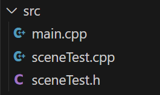

# LowPoly
3d graphics engine (framework) on C++ for esp32 microcontrollers. It uses advanced scene manager to execute scene logic and render models with TFT_eSPI library.
 
 **NO OPENGL USED, nothing of it! Rendering happens through primitives!**

 

## How to use LowPoly
This is framework and main logic of scenes happends in special files - _scenes_.


### Scene file

Minimal scene header file example 
```
#ifndef _TSCENE_
#define _TSCENE_

#include <lowPoly.h>

class Tscene : public Scene {
private:

    
public:
    void update(uint32_t deltaTime) override;
    void enter() override;
    void exit() override;
};

#endif
```

### Main file
To execute LowPoly you must include LowPoly and all scenes you need. Then you should create SceneManager object.
```
#include <lowPoly.h>

/////////scenes////////////
#include "sceneTest.h"//test scene

SceneManager sceneManager; //manager for scenes
```

In setup() you need to initialize SceneManager.
```
sceneManager.init();
sceneManager.changeScene(std::shared_ptr<Tscene>(new Tscene()));//set test scene
```

To make current scene to execute it's code you must call render function of SceneManager in loop.
```
sceneManager.render();
```

## Why LowPoly?
Ладно, я устал писать по английски, дальше по русски! 

Почему именно мой движок? - Я лично альтернатив не видел.

Проект является доведенной до прикольного результата попыткой имитировать трехмерную графику на микроконтроллере. В создании этого проекта мне помогли ультимативные знания математики 🤓

На самом деле результат показательный - на двух потоках (а именно столько имеет ESP32) нельзя эффективно рендерить трехмерную графику, придется переходить на ПЛИС.

## TODO
My version still far of what I want to do. Most important I need to simplify dev interface.
